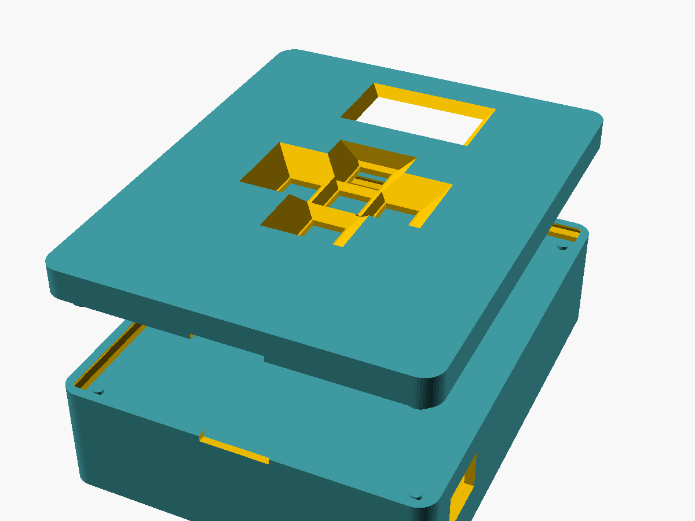
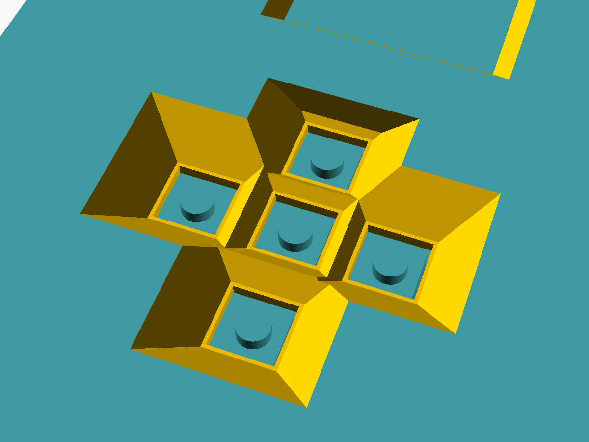

# MiniArcade case

3D printable case for the 70 x 90 mm perfboard. Everything is in
`miniarcade_case.scad` (OpenSCAD); the STL files next to it are rendered
from it and ready for the slicer.

| file | what | print |
|---|---|---|
| `testplate.stl` | 1.2 mm plate the size of the board - print this first | flat, ~10 min |
| `bottom.stl` | back shell: pegs for the board, battery guides, USB-C openings, switch hole, sound holes | floor down |
| `lid.stl` | front: display window, a funnel around each button, spring tabs | front face down |
| `plate.stl` | `bottom` + `lid` side by side, already in print position - one print job | as is |

No screws, no supports, no glue.

## Printing (Creality K2 Plus, Creality Print 7)

- Shells (`plate.stl` or `bottom.stl` + `lid.stl`): preset
  **0.20mm High Quality @Creality K2 Plus**, supports **off**, PLA (or PETG).
  15 % infill is plenty, 3 walls if you want it stiffer.
- Test plate: **0.20mm Standard** is enough.
- Don't rotate the parts: the orientation in the STL is the one that needs no
  supports.

Why no supports are needed:

- all slopes are 45 degrees or less (button funnels, the display window
  chamfer, the beads on the spring tabs, the snap groove)
- the switch hole in the wall is a teardrop (pointed top)
- the only bridges are the tops of the two USB-C openings (13 mm) and the
  small ridges between neighbouring button funnels - a K2 bridges these cleanly

## Test plate first

Lay the test plate on the front of the board:

- the 4 holes sit over the corner holes of the board
- the 5 switch bodies go through their square holes without touching
- the display window frames the picture (switch the console on)
- the notches on the left / right edge point at the two USB-C sockets

If something is off, change the number in the `.scad` file (e.g. `win_c`,
`buttons`, `usb_esp`) and render again:

    openscad -D 'part="lid"'   -o lid.stl   miniarcade_case.scad
    openscad -D 'part="plate"' -o plate.stl miniarcade_case.scad

## Please measure before printing the shells

These were estimated from photos:

| parameter | now | what |
|---|---|---|
| `btn_h` | 5.0 | top of a button plunger above the board - the bottom of each funnel sits there |
| `front_h` | 7.5 | tallest part on the front (display module) plus a little room |
| `back_h` | 16 | tallest part on the back (buzzer ~15 mm) plus room for the battery |
| `bat` | 51 x 66 x 5.5 | the Samsung battery |

If `btn_h` is a bit off the plungers only stand a little above or below the
funnel floor - the switch bodies pass through the holes either way.

## Assembly and opening

- Battery: lies in the corner guides on the floor.
- Board: front up onto the four pegs of the back shell (they go through the
  corner holes).
- Toggle switch: its M6 bushing goes through the hole in the top wall, held
  by its own nut on the outside. Move it with `switch_x` / `switch_z`.
- Lid: press it on until the four spring tabs click into the groove. Its
  bosses press the board onto the posts, so nothing rattles.
- Open: put a fingernail or a coin into the notch at the bottom edge and
  lever the lid up. If it is too tight or too loose, change `bead`
  (0.6 mm now) and print only the lid again.
- USB-C: both sockets are reachable through the openings in the side walls
  (the ESP32 on the left, the charger on the right).
